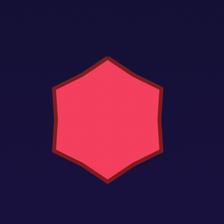

# KMPMedia Demo

A cross-platform (Android + iOS) playground app that exercises the
[KMPMedia](https://github.com/SolidKeyAB/kmpmedia) library — image loading, SVG
rendering, SVG animation, video, audio, layers, transformations — plus a mini
game built entirely from library primitives.

## See it running — one KMP codebase, both platforms

The **UFO Dodge** mini-game is built entirely from KMPMedia primitives: a streaming
**video backdrop** (`OGAVPlayer` — ExoPlayer on Android, AVPlayer on iOS) that
*conducts* the game via **cue points** (☄️ meteor-storm range-cue, 🌟 starfall
point-cue), static-SVG sprites, video-in-shape objects, and a black-hole **warp**
that swaps the backdrop to a new sector. The exact same `commonMain` code drives both:

| Android (emulator) | iOS (simulator) |
|:---:|:---:|
|  |  |

Inside that game, the **shape-shifting morph hazard** dogfoods the library's SVG
**path morphing** (`OGSvgNodeOverride.pathDataTo` + `morphProgress`): one `<path>`
tweens between a small spiky star and a big rounded crystal, so the hazard visibly
**expands, contracts and re-spikes**. Both `d` endpoints are parsed *once* and only
floats lerp per frame — so many can breathe at 60fps with no per-frame parse or
allocation. Here it is up close and slowed down (same `commonMain` code on iOS):

| The morph hazard, up close |
|:---:|
|  |

And the **Runtime-editable SVG** screen — one `.svg` parsed *once*, then any node
changed by its `id` at runtime (recolour / rotate / move), bound to Compose state.
A slider only mutates an `overrides` map keyed by node id and the same gauge redraws
live — the needle rotates and the arc + status dot recolour green→amber→red, with no
re-parse. Identical `commonMain` code on both platforms:

| Android (emulator) | iOS (simulator) |
|:---:|:---:|
|  |  |

## What's inside

| Section | What it shows |
|---------|---------------|
| **🎛️ Feature Playground** | The library's built-in `TestMainUI` — load images / SVGs / video / audio / layers from any URL, file, or bundled resource and tune every config live. |
| **🛸 UFO Dodge (mini-game)** | A vertical flyer whose sprites are all library-rendered: a static-SVG ship (`OGSVGView`), image meteors (`OGImageView`), vector meteors (`OGSVGView`) and a rare animated-SVG spinner (`OGSVGAnimationPlayer`). Compose drives motion + collision. |
| **🧪 Edge Cases** | Deliberately broken inputs (bad URL, unreachable host, 404, HTML-as-image, malformed SVG, missing resource) to confirm `onError` fires instead of crashing. |
| **⚡ Performance** | Live FPS / frame-time while rendering an adjustable number of animated-SVG / static-SVG / image sprites — a real rendering-throughput benchmark. |

## Architecture

- **`shared/`** — Kotlin Multiplatform module. All demo UI lives in
  `shared/src/commonMain/kotlin/com/solidkey/demo/`. Android entry:
  `MainActivity` (androidMain). iOS entry: `MainViewController()` (iosMain).
- **`androidApp/`** — thin Android application wrapper around `shared`.
- **`iosApp/`** — SwiftUI wrapper; `ContentView` hosts `MainViewControllerKt.MainViewController()`.
- The library is consumed **from local source** via a Gradle composite build:
  `settings.gradle.kts` has `includeBuild("../KMPMedia")` and substitutes
  `com.solidkey:kmpmedia-lib` with the sibling repo's `:library` project. No
  GitHub Packages / credentials needed — you always build the latest library code.

> Requires the `KMPMedia` repo checked out as a sibling directory
> (`../KMPMedia`). The demo was built against its `demo-latest` branch, which
> merges the release-readiness SVG work + audio/video `onError` + iOS video
> shape/movable.

## Prerequisites

- JDK 17
- Android SDK (compileSdk 34), an emulator or device
- Xcode 16+ (for iOS), an Apple Developer team for on-device install

## Run — Android

```bash
./gradlew :androidApp:assembleDebug          # build the APK
./gradlew :androidApp:installDebug           # install on a running emulator/device
```

APK output: `androidApp/build/outputs/apk/debug/androidApp-debug.apk` — sideload it directly.

## Run — iOS

1. Build the shared framework (produces `shared/build/XCFrameworks/release/shared.xcframework`,
   which the Xcode project links):
   ```bash
   ./gradlew :shared:assembleSharedReleaseXCFramework
   ```
2. Open `iosApp/iosApp.xcodeproj` in Xcode.
3. Select the `iosApp` scheme. For the **Simulator**, just Run. For a **physical
   device** (sideload), set your Team under *Signing & Capabilities* (the bundle
   id is `com.solidkey.kmpmediademo`), then Run.

> Bundled iOS assets live in `iosApp/iosApp/*.svg` + `iosApp/Resources/`. If you
> reference a new bundled resource from Kotlin, add the file to the Xcode target's
> *Copy Bundle Resources* too (iOS resolves resources from the app bundle).

## Notes

- Assets: SVGs load from `shared/src/androidMain/assets/` on Android and from the
  app bundle on iOS; images from `res/drawable` (Android) / bundle (iOS).
- Network edge-cases require internet; offline they simply exercise the error path.
